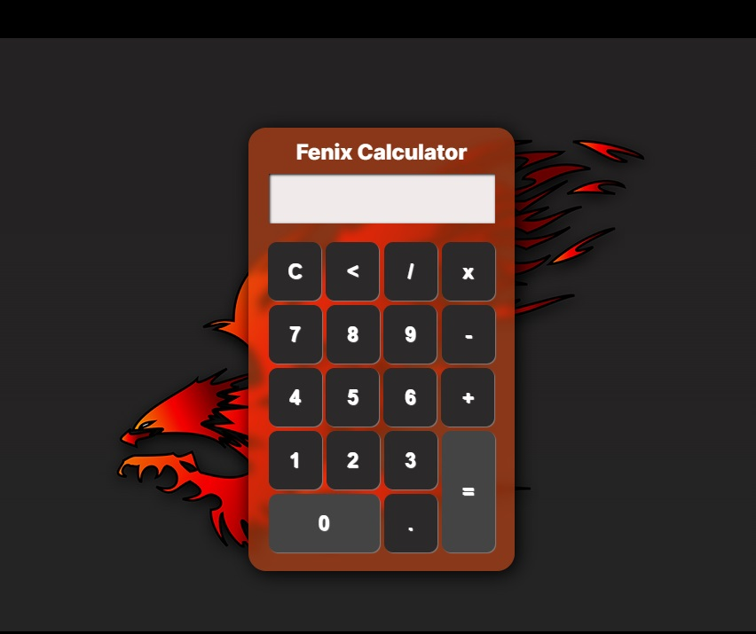
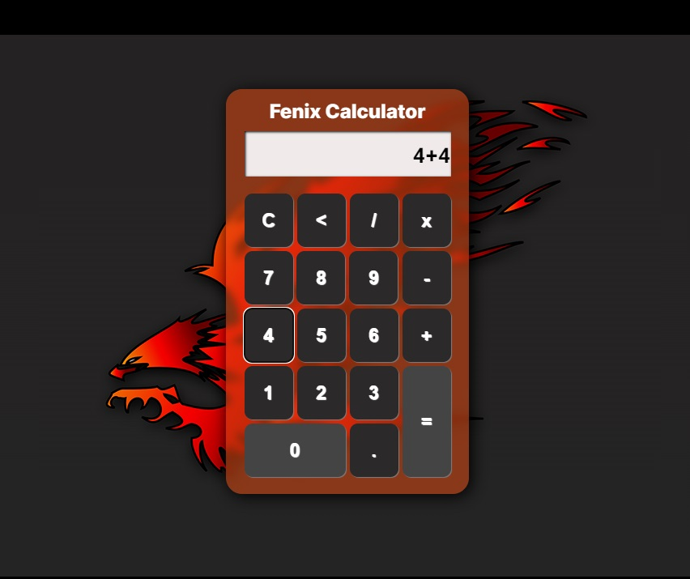
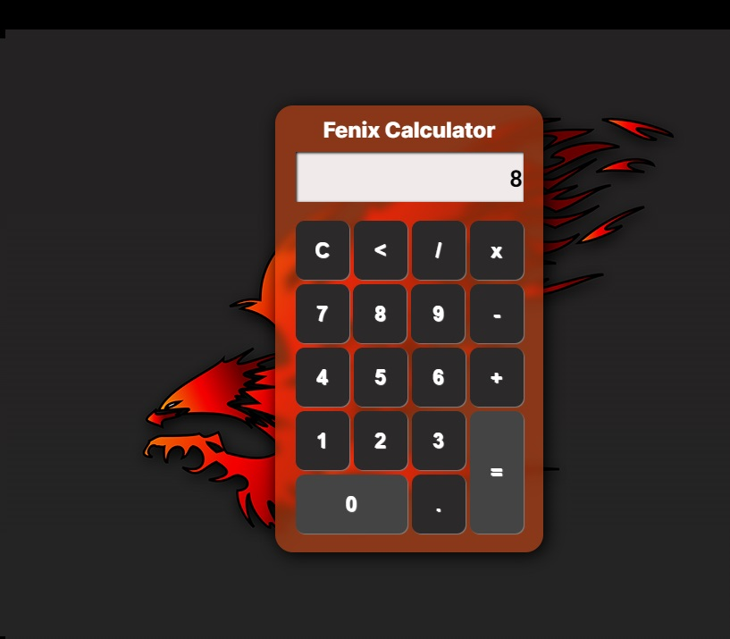

# Calculadora
 Desafio: Criando calculadora ultilizando CSS, HTML e JS
 [Acesse o APP](https://deybisonbr.github.io/calculadora/calculadora)
 
Prévia da Calculadora:
 
 
 
Função de Soma:
 
 

Resultado da Soma:

 
 
 A calculadora possui varias outras funções como multiplicar, dividir, subtrair, apagar o display, apagar numero por numero.
